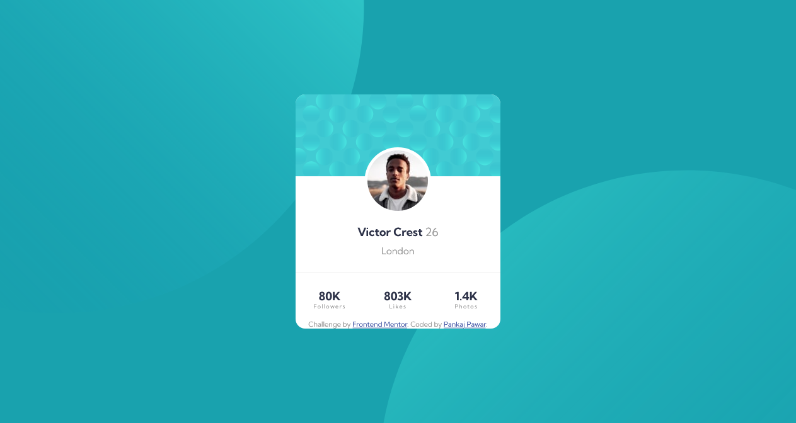
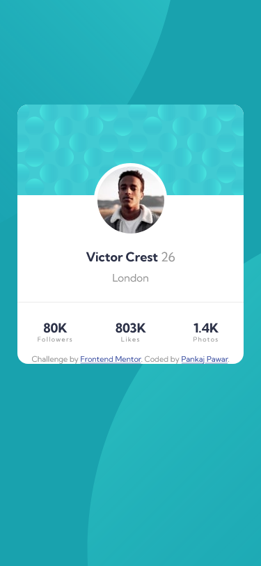

# Frontend Mentor - Profile card component solution

This is a solution to the [Profile card component challenge on Frontend Mentor](https://www.frontendmentor.io/challenges/profile-card-component-cfArpWshJ). Frontend Mentor challenges help you improve your coding skills by building realistic projects. 

## Table of contents

- [Overview](#overview)
  - [The challenge](#the-challenge)
  - [Screenshot](#screenshot)
  - [Links](#links)
- [My process](#my-process)
  - [Built with](#built-with)
  - [My Thoughts On My Work](#my-thoughts-on-my-work)
  - [Continued development](#continued-development)
- [Author](#author)
- [Acknowledgments](#acknowledgments)

## Overview

### The challenge

- Build out the project to the designs provided

### Screenshot

### Links

- Solution URL: [Github Repo Link](https://github.com/DamnItAzriel/profile-card-component)
- Live Site URL: [Profile Card Component](https://profile-card-component-taupe-one.vercel.app/)

## My process
- HTML
  - div main
    - div top card
    - div image victor
    - div details
      - span class name-stats
      - span
      - span
    - div follow
      - div followers
        - span class name-stats
        - span class text
      - div likes
        - span class name-stats
        - span class text
      - div photos
        - span class name-stats
        - span class text
    - div attribution

- CSS
  - margin padding set to 0
  - box-sizing set to border-box
  - width- 325px
  - text align- center
  - background color, bg-image
  - main class bg-color and border radius
  - div imageVictor display block
    - selecting img from this div
      - positioned as relative
        - top set to middle point for height to set it image in center
        - border-radius 50% for round image
  - div follow
    - Used flex here
    - to align all 3 same- gave all the 3 same width
  - Rounded corners to profile card
    - add specific borders like top left or top right to the div at top or to div at bottom
  - To add svg's as shown in design
    - I used different media queries for different width devices
    - Set background position x and y for the both svg's
    - Guessed a value and eyeballed this widths  

### Built with

- Semantic HTML5 markup
- CSS custom properties
- Flexbox

### My Thoughts On My Work
- Used a lot of spans in this project. Should I go with other semantics maybe.
- Should have used main and footer
- Spent/ Wasted a lot of time on background svg's to get perfect background pattern as shown in image and I feel I didn't reach the perfect solution yet. (1.5- 2 hours)
- Apart from the above points, I am okay with this project.

### Continued development

I struggled a lot with positioning background svg's. I managed to get this done by adding multiple media queries for multiple device widths. I am not sure whether it's a correct approach or not. (Took my 2 hours)
Will take a look at how someone else has done it.

I tried to swap 
 with <main> and 
 to <footer>. But that wasnt successful. Will gp after that at later time.

## Author

- Website - [Pankaj Pawar](https://www.twitter.com/DamnItAzriel)
- Frontend Mentor - [@DamnItAzriel](https://www.frontendmentor.io/profile/DamnItAzriel)
- Twitter - [@DamnItAzriel](https://www.twitter.com/DamnItAzriel)

## Acknowledgments

I would like to thank fronend mentors for creating this projects which has been helping get better at my HTML and CSS. Frontend mentor community gives me feedback regarding the webpage to improve my work further for which I am grateful.
